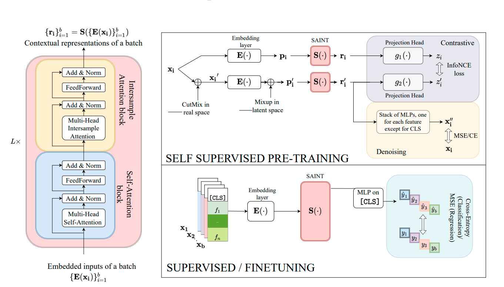

# Dependencies

```
absl-py==2.1.0
aiohappyeyeballs==2.4.4
aiohttp==3.11.12
aiosignal==1.3.2
antlr4-python3-runtime==4.9.3
appnope==0.1.4
asttokens==3.0.0
async-timeout==5.0.1
attrs==25.1.0
av==10.0.0
certifi==2025.1.31
charset-normalizer==3.4.1
comm==0.2.2
contourpy==1.3.1
cycler==0.12.1
debugpy==1.8.12
decorator==5.1.1
exceptiongroup==1.2.2
executing==2.2.0
filelock==3.17.0
fonttools==4.55.8
frozenlist==1.5.0
fsspec==2025.2.0
grpcio==1.70.0
hydra-core==1.3.2
idna==3.10
ipykernel==6.29.5
ipython==8.32.0
jedi==0.19.2
Jinja2==3.1.5
joblib==1.4.2
jupyter_client==8.6.3
jupyter_core==5.7.2
kiwisolver==1.4.8
lightning-utilities==0.12.0
Markdown==3.7
MarkupSafe==3.0.2
matplotlib==3.10.0
matplotlib-inline==0.1.7
mpmath==1.3.0
multidict==6.1.0
nest-asyncio==1.6.0
networkx==3.4.2
numpy==1.26.4
omegaconf==2.3.0
packaging==24.2
pandas==2.2.3
parso==0.8.4
pexpect==4.9.0
pillow==11.1.0
platformdirs==4.3.6
plotille==5.0.0
prompt_toolkit==3.0.50
propcache==0.2.1
protobuf==5.29.3
psutil==6.1.1
ptyprocess==0.7.0
pure_eval==0.2.3
Pygments==2.19.1
pyparsing==3.2.1
python-dateutil==2.9.0.post0
pytorch-lightning==2.5.0.post0
pytz==2025.1
PyYAML==6.0.2
pyzmq==26.2.1
requests==2.32.3
ruamel.yaml==0.18.10
ruamel.yaml.clib==0.2.12
scikit-learn==1.6.1
scipy==1.10.1
seaborn==0.13.2
six==1.17.0
stack-data==0.6.3
sympy==1.13.1
tensorboard==2.18.0
tensorboard-data-server==0.7.2
tensorboard-plugin-wit==1.8.1
threadpoolctl==3.5.0
torch==2.6.0
torchmetrics==1.6.1
torchtext==0.18.0
torchvision==0.21.0
tornado==6.4.2
tqdm==4.65.2
traitlets==5.14.3
typing_extensions==4.12.2
tzdata==2025.1
urllib3==2.3.0
wcwidth==0.2.13
Werkzeug==3.1.3
xgboost==2.1.4
yarl==1.18.3
```


```
get dataset from google drive 
get the `IEEE_Preprocess` dataset from drive
get the     data/ieee-train-merged_imputed_cleaned_dropped_stuff.csv also from google drive
```

```
basically run ssl (but before do a bunch of changes to float32 and make a big batchsize (if your ram can handle it)
also then run ft (don't change the fc now, let it be else u won't get train loss. also make a bunch of mods in train.py for on_train_epoch_end and the likes, make modification for binary auroc (this list of off the top of my head))
then change the fc in trainer.py and run predict.py to get the embeddings! (also make modifications to predict.py)
```

this is mostly it honestly.


# SAINT: Improved Neural Networks for Tabular Data via Row Attention and Contrastive Pretraining



Paper Reference: https://arxiv.org/abs/2106.01342

> NB: This implementation uses [Pytorch-lightning](https://pytorch-lightning.readthedocs.io/en/latest/) for setting up experiments and [Hydra](https://hydra.cc/) for configuration. For an earlier release of this code which does not use hydra, check the branch [saint-orig](https://github.com/ogunlao/saint/tree/saint-orig)

## Motivation

We decided to create an implementation of saint that can work with any tabular dataset, not jsut those mentioned in the paper. This implementation can be run with any tabular data for binary or multiclass classification. Regression is not supported.

## Code Structure

### Major modules implemented in the code

- Saint Transformer
- Saint Intersample Transformer
- Embeddings for tabular data
- Mixup
- CutMix
- Contrastive Loss
- Denoising Loss

For easy configuration, we decided to organize the code in a structured way

1. The base config file can be found the the `configs` directory. This contains most hyperparameters for training the models.
1. Configurations for experiments are split into `supervised` and `self-supervised` configs. The supervised config file is to be used as default when running predictive tasks while the self-supervised config file should be selected in case of self-supervised pre-training tasks. The files can be edited to suit your needs. In addition, there is a `predict` config file which we setup to make predictions on a test set (e.g. for kaggle)
1. Another config directory is dedicated to house all datasets configurations. This is the `data` sub-directory inside the configs directory. It includes hyperparameters like train, validation and test data paths and other data statistics. Samples of configs for supervised (indicated with names ending in "_sup") and self-supervised training (indicated with names ending in "_ssl") are provided for [bank](https://archive.ics.uci.edu/ml/machine-learning-databases/00222/bank.zip) dataset. They can be replicated for other custom datasets as well.

### Dataset

The datasets should live in the `data` directory. It is necessary to provide the absolute paths to the data folder in the data configs. Also, the datasets have to be pre-processed before running experiments. These are recommendations from the paper e.g data transforms using z-transform. Other recommendations are design decisions made by us.

#### Process your dataset in the following format

- Add a column named 'cls' to your dataset. The 'cls' column should be the first column as mentioned in paper
- Apply z-transform to numerical columns
- Label encode categorical columns
- It is required that categorical columns are separated from numerical columns. In particular, we track the total categorical columns in the dataframe by the number of columns. Therefore, you need split the data into categorical columns and numerical columns, compute some statistics as explained below, then merge them to form a new dataframe which can be understood by the model. Note that all categorical columns appear before the numerical columns in the data. The cls column is expected the be the first column and it is counted as a categorical column.
- Calculate the number of categorical columns (including 'cls' column) and numerical columns. Include these statistics under `data_stats` in the data configs of your particular dataset.
- Also, you will need to provide the number of categories in each categorical column in the data config. These are required to build proper embeddings for the model. It should also be provided as an array in the `data.data_stats.cats` parameter or hard coded in the data config. Note that the cls column has 1 category and is always indicated as 1 in the array.
- Save your processed files as train, val and test csvs in `data` folder. 

> A sample function named `preprocess.py` is included under `src > dataset.py` that explains the preprocessing strategy. You may need to modify this function depending on the dataset. Also, tutorial notebooks are provided in `notebooks` folder to showcase how to preprocess custom datasets and run experiments. Look at [Bank_Dataset.ipynb](notebooks/Bank_Dataset.ipynb)

## How to set it up

### Clone the repository

```git
git clone https://github.com/ogunlao/saint.git
```

### Setup a new environment

1. Activate your virtual environment. It is advisable to use a virtual environment to setup this code.
2. Install dependencies using the `requirements.txt` file provided

```python
pip3 install -r requirements.txt 
```

3. Update the config.yaml file with your hyperparameters. Alternatively, you can provide your settings on the command-line while running experiments. A good knowledge of hydra might be required.

### Run `python main.py` with command-line arguments or with your edited config file

Examples

1. To train saint-intersample (saint-i) model in self-supervised mode using bank dataset, run;

```bash
python main.py experiment=self-supervised \
    experiment.model=saint_i \
    data=bank_ssl \
    data.data_folder=/content/saint/data
```

2. To train saint model in supervised mode using bank dataset, run;

```bash
python main.py experiment=supervised \
    experiment.model=saint \
    data=bank_sup \
    data.data_folder=/content/saint/data
```

3. To make prediction using saint model in supervised mode using bank dataset, run;

```bash
!python saint/predict.py experiment=predict \
    experiment.model=saint \
    experiment.pretrained_checkpoint=["PATH_TO_SAVED_CKPT"] \
    experiment.pred_sav_path=["PATH_TO_SAVE_PREDICTION.csv"] \
    data=bank_sup \
    data.data_folder=/content/saint/data
```

> You may need to run some hyperparameter search to determine the best model for your task. Hydra provides this functionality out of the box with [multirun](https://hydra.cc/docs/tutorials/basic/running_your_app/multi-run).

## Contributors

- [Ahmed A. Elhag](https://github.com/Ahmed-A-A-Elhag)
- [Aisha Alaagib](https://github.com/AishaAlaagib)
- [Amina Rufai](https://github.com/Aminah92)
- [Amna Ahmed Elmustapha](https://github.com/AMNAALMGLY)
- [Jamal Hussein](https://github.com/engmubarak48)
- [Mohammedelfatih Salah](https://github.com/mohammedElfatihSalah)
- [Ruba Mutasim](https://github.com/ruba128)
- [Sewade Olaolu Ogun](https://github.com/ogunlao)

(names in alphabetical order)
