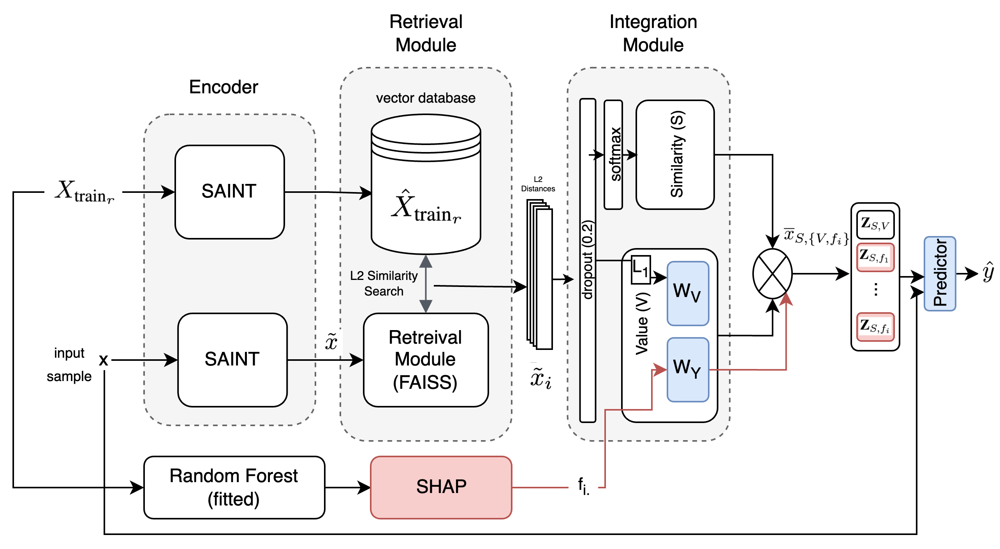

> Official implementation of "FAR-FD: Feature Augmented Retrieval for Fraud Detection"  

Abstract:
Fraud detection plays a crucial role in the financial industry, preventing significant financial losses. Traditional rule-based systems and manual audits often struggle with the evolving nature of fraud schemes and the vast volume of transactions. While traditional machine learning and deep learning methods have made headway, significant room for improvement remains with problems such as class imbalance, high feature cardinality and adversarial dynamics. To address these limitations, we propose FAR-FD, the first work to integrate a subset of important features in Retrieval Augmented Classification (RAC), and the second work to use RAC for fraud detection. Our model utilises a pre-trained SAINT encoder, a self-supervised learning method, comprising of retrieval, integration, and predictor modules, jointly trained to dynamically leverage similar instances for each input sample. This approach not only enables the model to utilize the context of similar fraud patterns but uniquely positions it for real-time fraud detection by maintaining an external database that can be continuously updated as sophisticated fraud patterns emerge without requiring model retraining. We validate the effectiveness of FAR-FD through extensive experiments on a large scale real-world dataset and achieve state-of-the-art performance in detecting fraudulent activities.

**TLDR; Using few important features as context in a retreival augmented classification system to predicit fraud.**

## System Diagram:

    

## Experimental Results

    

## Steps to clone and run

1. Clone the repository.
2. Download the IEEE CIS Dataset from Kaggle ([link](https://www.kaggle.com/competitions/ieee-fraud-detection/data)) and save it in a new directory called `datasets/ieee-fraud-detection-datasets/{train/test}`. Move the `test_identity.csv` and `test_transaction.csv` into the `datasets/ieee-fraud-detection-datasets/test` and the `train_identity.csv` and `train_transaction.csv` and move it to `datasets/ieee-fraud-detection-datasets/train`.
3. Run `0_combine_ieee_cis.ipynb` in `0_pre-process-data` with the Kaggle dataset. This will generate two dataframes in the `datasets/ieee-processed` directory named [ieee-train-merged.csv](datasets/ieee-processed/ieee-train-merged.csv) and [ieee-train-merged_imputed_cleaned.csv](datasets/ieee-processed/ieee-train-merged_imputed_cleaned.csv). We will use `ieee-train-merged_imputed_cleaned.csv` for the rest of the experiments.
4. Now, we have to encode our dataset. We use the SAINT encoder published in [this paper](https://arxiv.org/abs/2106.01342) ([official code](https://github.com/somepago/saint)). We use the [unofficial SAINT implementation](https://github.com/ogunlao/saint?tab=readme-ov-file) for our experiments. Using the generated `ieee-train-merged_imputed_cleaned.csv` run the `0_ieee-preprocess-dataset-split-saint.ipynb` notebook.
5. 
6. Then run `dataset_split.ipynb` to obtain the train, validation and test splits.

## 📂 Access Preprocessed Datasets

We provide the preprocessed datasets used in our experiments. You can download them from the following link:

### 🔗 [**Preprocessed Datasets (Google Drive)**](https://drive.google.com/drive/folders/18Jp6mPx0kBI6_GV01fBAnj9RQtBOgOUG?usp=sharing)

## 📂 Access Original Dataset

https://www.kaggle.com/competitions/ieee-fraud-detection/data
